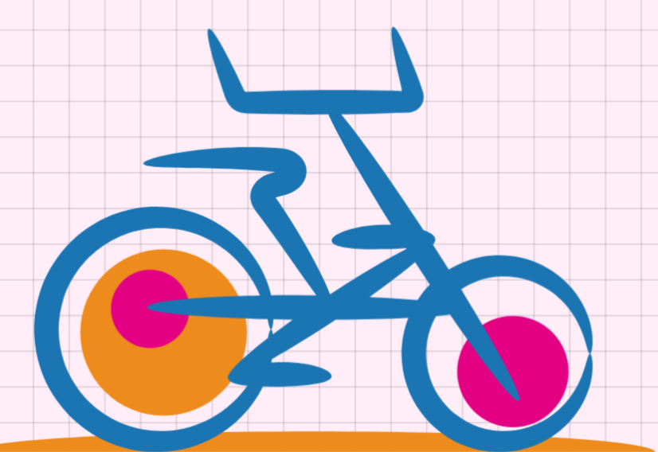
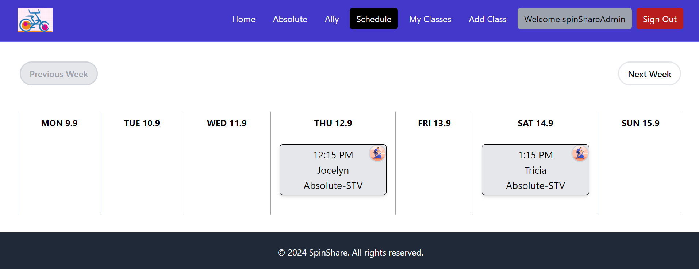
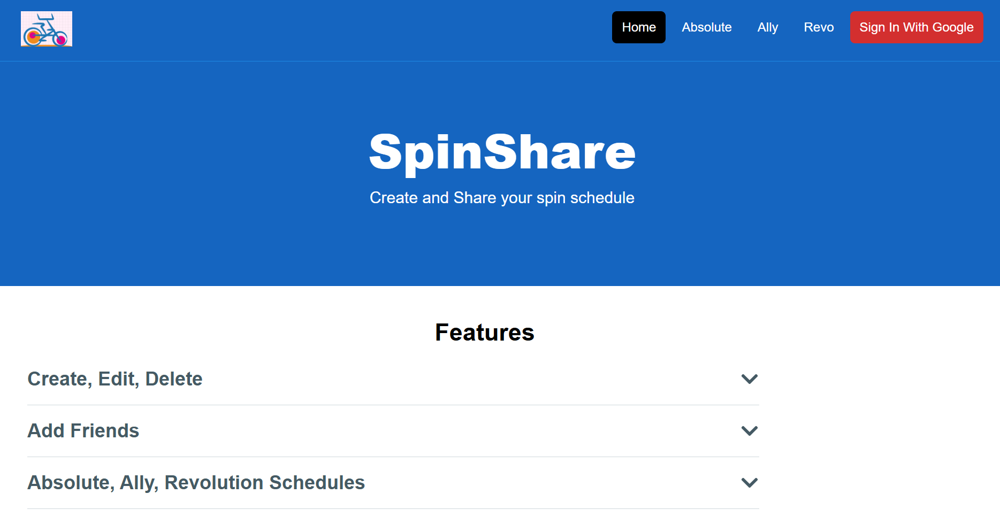
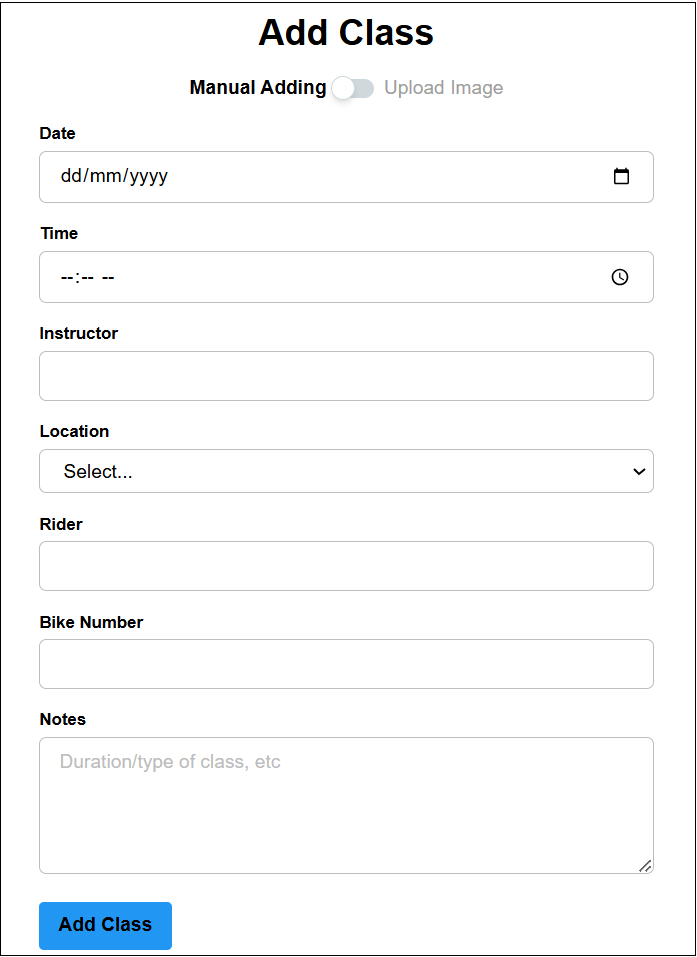

<!--
*** I'm using markdown "reference style" links for readability.
*** Reference links are enclosed in brackets [ ] instead of parentheses ( ).
*** See the bottom of this document for the declaration of the reference variables
*** for contributors-url, forks-url, etc. This is an optional, concise syntax you may use.
*** https://www.markdownguide.org/basic-syntax/#reference-style-links
-->
[![Contributors][contributors-shield]][contributors-url]
[![Forks][forks-shield]][forks-url]
[![Stargazers][stars-shield]][stars-url]
[![Issues][issues-shield]][issues-url]
[![LinkedIn][linkedin-shield]][linkedin-url]

<!-- PROJECT LOGO -->
 

  

<h2 align="center">SpinShare</h2>
  

    Spin schedule sharing web app
     
    <a href="https://github.com/SQ77/spinShare/issues/new?labels=bug&template=bug-report---.md">Report Bug</a>
    ·
    <a href="https://github.com/SQ77/spinShare/issues/new?labels=enhancement&template=feature-request---.md">Request Feature</a>
  

<!-- TABLE OF CONTENTS -->

  
Table of Contents

  <ol>
    <li>
      <a href="#about-the-project">About SpinShare</a>
      <ul>
        <li><a href="#built-with">Built With</a></li>
      </ul>
    </li>
    <li>
      <a href="#getting-started">Getting Started</a>
    </li>
    <li><a href="#usage">Usage</a></li>
    <li><a href="#roadmap">Roadmap</a></li>
    <li><a href="#contributing">Contributing</a></li>
    <li><a href="#contact">Contact</a></li>
    <li><a href="#acknowledgments">Acknowledgments</a></li>
  </ol>

<!-- ABOUT THE PROJECT -->
## About SpinShare

 

SpinShare is a schedule sharing web app for users to create, edit and share their spin schedule.
Inspired by the hassle of individually asking friends for their schedules, SpinShare simplifies the process by providing a centralized platform where users can share and view each other's spin class times, making coordination and planning much more convenient. 

(<a href="#readme-top">back to top</a>)

### Built With

* [![React][React.js]][React-url]
* [![TailwindCSS][TailwindCSS]][TailwindCSS-url]
* [![Vite][Vite]][Vite-url]
* [![NodeJS][NodeJS]][NodeJS-url]
* [![Firebase][Firebase]][Firebase-url]

(<a href="#readme-top">back to top</a>)

<!-- GETTING STARTED -->
## Getting Started

1. Go to the [spinShare website](https://spinshare77.web.app/)
2. Create an account by signing in with Google
3. Add classes to your schedule
4. Share them with friends

(<a href="#readme-top">back to top</a>)

<!-- USAGE EXAMPLES -->
## Usage

### Home Page

Users are greeted by this page when they visit the SpinShare website. They are able to view the Absolute and
Ally schedules for the current week and learn about the main features of SpinShare. Clicking on the 
"Sign In With Google" button will allow users to login to their account.

### Add Class

This feature offers a clean and intuitive interface where users can easily input details like the class name, instructor, date, time, and location. This user-friendly design ensures that adding a class is a hassle-free experience.

(<a href="#readme-top">back to top</a>)

<!-- ROADMAP -->
## Roadmap

- [x] Schedule displaying classes
- [x] Add and edit classes
    - [x] View past and upcoming classes
- [x] Friend system
    - [x] Send friend requests
    - [x] Add and remove friends
    - [x] View friends' classes in your schedule
    - [ ] Invite friends to join classes
- [x] Absolute and Ally schedules (updated weekly)
- [ ] Revolution schedule (updated weekly)

See the [open issues](https://github.com/SQ77/spinShare/issues) for a full list of proposed features (and known issues).

(<a href="#readme-top">back to top</a>)

<!-- CONTRIBUTING -->
## Contributing

Contributions are what make the open source community such an amazing place to learn, inspire, and create. Any contributions you make are **greatly appreciated**.

If you have a suggestion that would make this better, please fork the repo and create a pull request. You can also simply open an issue with the tag "enhancement".
Don't forget to give the project a star! Thanks again!

1. Fork the Project
2. Create your Feature Branch (`git checkout -b feature/AmazingFeature`)
3. Commit your Changes (`git commit -m 'Add some AmazingFeature'`)
4. Push to the Branch (`git push origin feature/AmazingFeature`)
5. Open a Pull Request

(<a href="#readme-top">back to top</a>)

### Top contributors:

<!-- CONTACT -->
## Contact

Shiqi - [Admin email](spinshare123@gmail.com)

Feedback Form: [Help to improve spinShare!](https://forms.gle/tdwYwGHz7By5hCn5A)

Project Link: [https://github.com/SQ77/spinShare](https://github.com/SQ77/spinShare)

(<a href="#readme-top">back to top</a>)

<!-- ACKNOWLEDGMENTS -->
## Acknowledgments

* [Developer - Shiqi](https://github.com/SQ77/)

(<a href="#readme-top">back to top</a>)

<!-- MARKDOWN LINKS & IMAGES -->
<!-- https://www.markdownguide.org/basic-syntax/#reference-style-links -->
[contributors-shield]: https://img.shields.io/github/contributors/SQ77/spinShare.svg?style=for-the-badge
[contributors-url]: https://github.com/SQ77/spinShare/graphs/contributors
[forks-shield]: https://img.shields.io/github/forks/SQ77/spinShare.svg?style=for-the-badge
[forks-url]: https://github.com/SQ77/spinShare/network/members
[stars-shield]: https://img.shields.io/github/stars/SQ77/spinShare.svg?style=for-the-badge
[stars-url]: https://github.com/SQ77/spinShare/stargazers
[issues-shield]: https://img.shields.io/github/issues/SQ77/spinShare.svg?style=for-the-badge
[issues-url]: https://github.com/github_username/repo_name/issues
[linkedin-shield]: https://img.shields.io/badge/-LinkedIn-black.svg?style=for-the-badge&logo=linkedin&colorB=555
[linkedin-url]: https://www.linkedin.com/in/zhu-shiqi/
[product-screenshot]: images/screenshot.png
[TailwindCSS]: https://img.shields.io/badge/Tailwind%20CSS-%2338B2AC.svg?logo=tailwind-css&logoColor=white
[TailwindCSS-url]: https://tailwindcss.com/
[React.js]: https://img.shields.io/badge/React-%2320232a.svg?logo=react&logoColor=%2361DAFB
[React-url]: https://reactjs.org/
[NodeJS]: https://img.shields.io/badge/Node.js-6DA55F?logo=node.js&logoColor=white
[NodeJS-url]: https://nodejs.org/en
[Firebase]: https://img.shields.io/badge/Firebase-039BE5?logo=Firebase&logoColor=white
[Firebase-url]: https://firebase.google.com/
[Vite]: https://img.shields.io/badge/Vite-646CFF?logo=vite&logoColor=fff
[Vite-url]: https://vitejs.dev/
